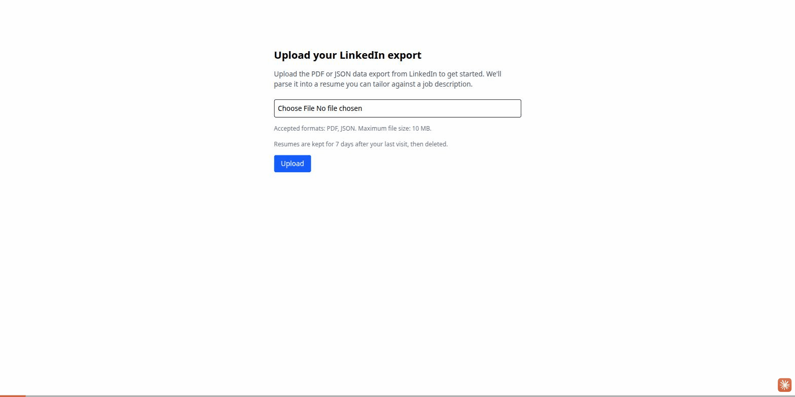

# Resume ATS Optimizer

A hosted tool for tailoring a resume against a specific job posting. Upload a LinkedIn
data export, paste a job description, and get back an ATS-friendly resume — reworded to
match the posting's language without inventing anything — as a downloadable PDF. Built
for anyone tired of manually reformatting the same resume for every application.

## Stack

Rails 8, Hotwire (Turbo + Stimulus) monolith — no separate JS frontend, no Node build
step. Postgres is the only stateful dependency: Rails 8's Solid trio (Queue, Cache,
Cable) runs background jobs, caching, and pub/sub off the same instance instead of
adding Redis. LLM calls (resume extraction, requirement extraction, bullet rewriting) go
through `RubyLLM` to Claude; PDFs are rendered with Prawn, not a headless-browser
pipeline. Deployment is intended to be Kamal to a single VPS — see Limitations below for
where that actually stands. Full reasoning for each of these lives in `docs/adr/`.

## Architecture decisions, documented

This repo keeps 26 ADRs (`docs/adr/`) — not just "we chose X," but the alternatives
considered, what was measured, and more than once, a wrong assumption caught and
corrected. A few worth reading on their own:

- **[ADR-0021](docs/adr/0021-cache-the-optimization-result-between-preview-and-download.md)**
  — caching the bullet-rewrite result between preview and download. Started as a cost
  optimization, turned up a real correctness bug (the previewed and downloaded resumes
  could silently disagree), and backs its concurrency/timing decisions with measured
  latency tables — explicit about the limits of an eight-sample benchmark rather than
  presenting it as more precise than it is.
- **[ADR-0019](docs/adr/0019-count-llm-calls-at-the-provider-boundary.md)** — the daily
  LLM spend cap was counting once per user-facing flow instead of once per actual
  provider request, silently permitting several times its stated limit; fixed with a
  stateless metered-chat pattern instead of a bigger counter.
- **[ADR-0024](docs/adr/0024-refuse-scripts-requiring-shaping.md)** — corrects a
  previous wrong root-cause guess for a font-embedding failure (it wasn't the font
  container format, it was CFF vs. TrueType outlines), and separately catches Hebrew
  rendering backwards — a different word, not just an ugly one — despite full glyph
  coverage. Text extraction couldn't have caught that; only rendering and looking at it
  could.
- **[ADR-0022](docs/adr/0022-job-description-reference-instead-of-queue-argument.md)**
  — finds that Rails' `config.filter_parameters` has never redacted Active Job
  arguments, in any version, which had been silently leaking job-description text into
  logs. Fixed by passing an encrypted database reference through the queue instead of
  the text itself.

Full index: [`docs/adr/README.md`](docs/adr/README.md).

## Known limitations

- **No authentication.** Resumes are scoped to a session token, not a user account
  ([ADR-0007](docs/adr/0007-rails8-auth-and-owner-token-placeholder.md)).
- **The per-session usage quota is not abuse control.**
  [ADR-0023](docs/adr/0023-per-session-usage-quotas-in-postgres.md) says so directly,
  and the global daily cap it sits alongside has no per-caller dimension — a known,
  open, trivially exploitable gap ([issue #106](https://github.com/jeanflaragao/resume-ats-optimizer/issues/106)).
- **Scripts requiring complex text shaping are refused, not mis-rendered.** Hebrew,
  Arabic, and Devanagari resumes are rejected outright rather than rendered backwards or
  disconnected ([issue #103](https://github.com/jeanflaragao/resume-ats-optimizer/issues/103),
  [ADR-0024](docs/adr/0024-refuse-scripts-requiring-shaping.md)).
- **Not yet deployed.** `config/deploy.yml` doesn't exist yet — see
  [issue #48](https://github.com/jeanflaragao/resume-ats-optimizer/issues/48).

## Live deployment

Not yet live — platform undecided. `[placeholder — link goes here once #48 ships]`

## Built with Claude Code

This app was built with Claude Code, with the author acting as technical reviewer, not
as a rubber stamp. Concretely, that review caught:

- **A misdiagnosed root cause** ([issue #81](https://github.com/jeanflaragao/resume-ats-optimizer/issues/81)) — a font-embedding failure was first
  attributed to the wrong cause; testing that guess (rather than trusting it) produced
  the same failure again, which is what led to the real cause and the fix in
  [ADR-0024](docs/adr/0024-refuse-scripts-requiring-shaping.md).
- **A trivial DoS** ([issue #106](https://github.com/jeanflaragao/resume-ats-optimizer/issues/106)) — the global daily LLM-call cap has no per-caller
  dimension, so two incognito windows and ten uploads can exhaust the entire service's
  daily budget for every user.
- **A quota-ordering bug** — the PDF-generation quota was being charged before the
  free, deterministic check that would refuse the request anyway, so a guaranteed
  rejection still cost the user a slot. Fixed by reordering the check, not by refunding
  ([ADR-0025](docs/adr/0025-check-renderability-before-spending-quota.md)).
- **A Hebrew rendering failure automated checks reported as passing** — glyph-coverage
  checks said the font supported every character, which was true and also not the
  point: the flow-layout renderer draws left-to-right regardless of script, so Hebrew
  came out as a different, backwards word. Only rendering and visually inspecting the
  output caught it ([ADR-0024](docs/adr/0024-refuse-scripts-requiring-shaping.md)).

## Setup and development

Local setup, running tests, and internal conventions are documented in
[`CLAUDE.md`](CLAUDE.md) rather than duplicated here.
